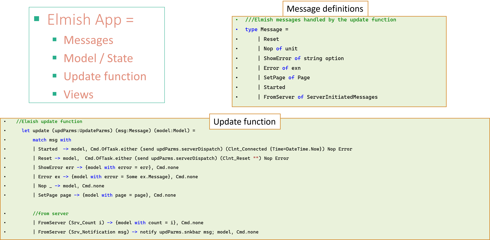

# 'Contemporary' Web Stack
A web stack for build reactive applications with seamless 2-way communication between browser and server
[Ideal for Gen AI chat type applications]

This repo contains an example **Contempory** web stack application, which can be used as a starter app or be used to understand the stack in detail.

## Overview
- Web Arch. Stack Comparison
- ‘Contemporary’ vs. traditional web
- 'Contemporary' Macro Architecture
- 'Contemporary' Internal Architecture
- Example Code
- Summary

## Comparison of Contemporary with Traditional

### 'Contemporary' 
- Front End: 
    - F# of web assembly
- UI Framework based on
    - Functional Reactive Programming (FRP)5 
    - Data: SignalR (over websockets)
- Backend: F# (ASP.Net)
- Data: SignalR 
- Orch: Semantic Kernel

### Traditional web stack*
- Front End: 
    - TypeScript / JavaScript
    - React.js + Node.js
- Data: Async callbacks
- Back End: Java | Python | .Net | 
- Data: API
- Orch: Semantic Kernel  | LangChain

## Contemporary: Macro Architecture

## Pros and Cons: Contemporary vs Traditional

## Contemporay Micro Architecture

## Example Code

## Example UI Code

# Summary

- Contemporary Web Stack: WebAssembly (WASM) + FRP + SignalR
    - F# - both client and server side
    - Some utility JavaScript functions
- Elmish – FRP implementation
    - Elegant and modular – easy to  integrate new functionality
    - Seamless bi-directional message flow (client  server) with SignalR
- MudBlazor - UI Controls (uses React.js underneath)
- F# - functional programming language 
    - Expressive and type-safe (generally, gives same result with less code)
    - Broad reach – from Data Science - big data (Spark), to mobile & web development
- WebAssembly
    - Remember this name as much more is to come, including cloud workload containers

