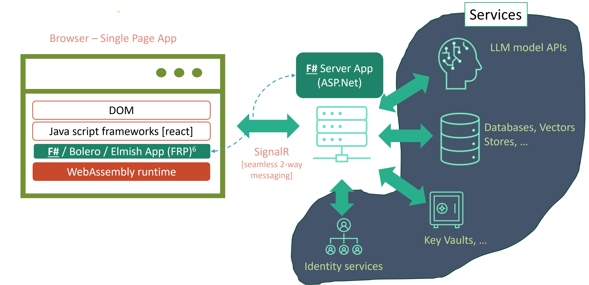
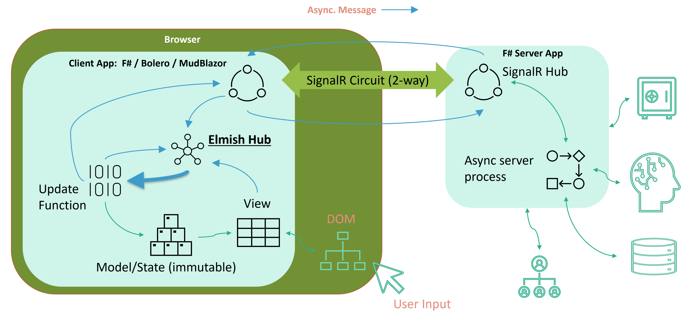

# *Contemporary* Web Stack (CoWS)  
A web stack for build reactive applications with seamless 2-way communication between browser and server 

[Ideal for Gen AI chat type applications]

This repo contains an example **Contempory** web stack application, which can be used as a starter app or to understand the stack in detail.

# Setup and Installation

### Requirements
- Dotnet SDK (8.0 as of now)
- Visual Studio Code with F# Ionide plugin
- Or Visual Studio with F# components installed

### Running
- Clone this repo and open the repo folder in VS Code 
- Goto "Run and Debug" tab in VS Code
- Launch "Debug Client + Server" launch configuration.

# *Contemporary* Web Stack

## Overview
- Web Arch. Stack Comparison
- ‘Contemporary’ vs. traditional web
- 'Contemporary' Macro Architecture
- 'Contemporary' Internal Architecture
- Example Code
- Summary

## Comparison of *Contemporary* with Traditional Stack

### *Contemporary*
- **Front End**: 
    - F# on web assembly
    - *UI Framework based on*:
        - [Functional Reactive Programming (FRP)](https://www.linkedin.com/pulse/elegant-web-application-architecture-contemporary-times-faisal-waris-hykqc/?trackingId=fsmQ9J1jSS60KZgaOE%2F1Ig%3D%3D)
            - [Bolero](https://fsbolero.io/docs/)
            - [Elmish](https://elmish.github.io/elmish/)
    - [MudBlazor](https://mudblazor.com/) (optional)
    - Data: [SignalR](https://learn.microsoft.com/en-us/aspnet/core/blazor/tutorials/signalr-blazor?view=aspnetcore-8.0&tabs=visual-studio) (over websockets)
- **Backend**: F# (ASP.Net)
    - Data: SignalR 
    - Orch: Semantic Kernel

### Traditional web stack
- **Front End**: 
    - TypeScript / JavaScript
    - React.js + Node.js
    - Data: Async callbacks
- **Backend**: Java | Python | .Net | ...
    - Data: API
    - Orch: Semantic Kernel  | LangChain

## *Contemporary* Macro Architecture

## Pros and Cons: *Contemporary* vs Traditional

## *Contemporary* Micro Architecture

## Example Code

## Example UI Code

# Summary

- *Contemporary* Web Stack: WebAssembly (WASM) + FRP + SignalR
    - F# - both client and server side
    - Some utility JavaScript functions
- Elmish – FRP implementation
    - Elegant and modular – easy to  integrate new functionality
    - Seamless bi-directional message flow (client <-> server) with SignalR
- MudBlazor - UI Controls (uses React.js underneath)
- F# - functional programming language 
    - Expressive and type-safe (generally, gives same result with less code)
    - Broad reach – from Data Science - big data (Spark), to mobile & web development
- WebAssembly
    - Remember this name as much more is to come, including cloud workload containers

